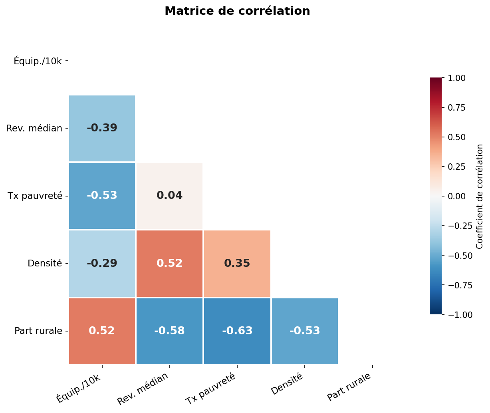

# Inégalités territoriales d'accès aux équipements sportifs en France

**Auteurs** : DELETANG Arthur, GOUALOU Maxence, SERVANT Lucas  
**Cours** : Python pour la Data Science — 2025-2026

Les inégalités d'accès aux équipements sportifs entre départements français sont-elles le reflet des inégalités socio-économiques ? Ce projet mobilise des données open data pour répondre à cette question à travers une analyse descriptive, une visualisation cartographique et une modélisation statistique.

---

## Lancer le code

### Prérequis

```bash
pip install -r requirements.txt
```

### Exécution

Ouvrir et exécuter toutes les cellules du notebook `main.ipynb` dans l'ordre.

Les données sont téléchargées automatiquement via les APIs au moment de l'exécution — aucun fichier à télécharger manuellement.

---

## Données

### Sources

| Source | Description | Méthode | Fiabilité |
|---|---|---|---|
| [Ministère des Sports — Data ES](https://equipements.sports.gouv.fr) | Recensement national des équipements sportifs | API REST Opendatasoft (CSV direct) | Officielle, mise à jour quotidienne |
| [INSEE via Data ES](https://equipements.sports.gouv.fr/explore/dataset/insee-2020-geoapi-2023) | Données socio-économiques communales (Filosofi 2020) | API REST Opendatasoft (CSV direct) | Officielle INSEE |
| [france-geojson (GitHub)](https://github.com/gregoiredavid/france-geojson) | Contours géographiques des départements | Requête HTTP (GeoJSON) | Basé sur données IGN officielles |

### Variables principales

| Variable | Source | Description |
|---|---|---|
| `equip_10k` | Calculée | Nombre d'équipements sportifs pour 10 000 habitants par département |
| `revenu_median` | INSEE / Filosofi (`MED20`) | Revenu médian disponible par unité de consommation — moyenne pondérée par la population des médianes communales |
| `taux_pauvrete` | INSEE / Filosofi (`TP6020`) | Part de la population sous le seuil de pauvreté à 60% — moyenne pondérée par la population |
| `densite` | Calculée | Population / superficie (hab./km²) |
| `part_rural` | INSEE (`TYPO_RURB_CRTE`) | Part des communes rurales dans le département, selon la grille de densité officielle INSEE (2020) |

---

## Principaux résultats

En moyenne, on compte **65 équipements sportifs pour 10 000 habitants** en France. Ce chiffre masque des disparités importantes : les départements ruraux et peu peuplés (Hautes-Alpes, Lozère) affichent des ratios très élevés (>100), tandis que les départements urbains denses (Paris, Hauts-de-Seine) sont les moins bien dotés en relatif (<20).

La matrice de corrélation révèle que la **densité de population** est la variable la plus corrélée négativement avec la densité d'équipements (r ≈ −0.8), devant la **part rurale** (corrélation positive) et le **taux de pauvreté** (corrélation négative modérée).



---

## Modélisation

**Variable cible** : `equip_10k`  
**Variables explicatives** : `revenu_median`, `taux_pauvrete`, `densite`, `part_rural`

Deux modèles sont comparés :

| Modèle | R² test |
|---|---|
| Régression linéaire (OLS) | 0.693 |
| Random Forest | 0.875 |

Le Random Forest capture mieux les relations non linéaires entre territoire et équipements sportifs. L'analyse des importances montre que la **densité de population** est de loin la variable la plus explicative, suivie du taux de pauvreté et du revenu médian.

---

## Bibliographie

- INSEE (2021). *Une nouvelle définition du rural pour mieux rendre compte des réalités des territoires*. La France et ses territoires, édition 2021.
- Ministère des Sports (2025). *Data ES — Recensement des équipements sportifs*. https://equipements.sports.gouv.fr
- INSEE. *Filosofi — Fichier localisé social et fiscal*. https://www.insee.fr/fr/metadonnees/source/serie/s1172
- Galiana, L. (2025). *Python pour la data science*. https://pythonds.linogaliana.fr
